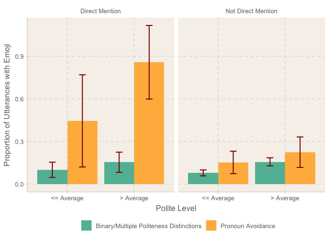

Politeness Function of Emoji and Emoticons in CMCs
================
Wanitchaya Poonpatanapricha

Load Data
---------

``` r
# load data with processed text, language tag, and classified polite level
df1 <- read_csv('tsuki_polite5.csv') %>%
  select(-X1)%>%
  drop_na(text, is_emoji) %>%
  # create the direct mention feature
  mutate(reply = ifelse(str_detect(text, "<user_mention>"), 1, 0)) %>%
  # create the controling variable for eastern/western
  mutate(east = ifelse(language %in% c("es", "en", "de", "pt", "ru", "fr"),     
                       0, 1)) %>%
  # change types of variables
  mutate(is_emoji = ifelse(is_emoji, 1, 0),
         is_emoji = as.factor(is_emoji),
         east = as.factor(east),
         reply = as.factor(reply))

# load WALS' pronoun distinctions
polite <- read_csv('polite_language.csv')

# merge the 2 data for hypothesis 2
rf_data <- inner_join(df1, polite) %>%
  # remove text with English language tag (originally no tag)
  filter(language != 'en') %>%
  dplyr::select(-emoji, -language) %>%
  drop_na() %>%
  # combine multiple and binary pronoun distinctions + renumber polite level
  mutate(polite_class = ifelse(polite_class %in% c("Multiple", "Binary"), 0, 1),
         polite_class = as.factor(polite_class),
         polite = polite_5 - 2) %>%
  # remove repeated observations
  distinct() %>%
  dplyr::select(-text)

# another data for hypothesis 1 (with texts without language tags)
data <- inner_join(df1, polite) %>%
  dplyr::select(-emoji, -language) %>%
  drop_na() %>%
  mutate(polite_class = ifelse(polite_class %in% c("Multiple", "Binary"), 0, 1),
         polite_class = as.factor(polite_class),
         polite = polite_5 -2) %>%
  distinct()

# data for only texts without language tags
en_data <- inner_join(df1, polite) %>%
  filter(language == 'en') %>% #, 
  dplyr::select(-emoji, -language) %>%
  drop_na() %>%
  mutate(polite_class = ifelse(polite_class %in% c("Multiple", "Binary"), 0, 1),
         polite_class = as.factor(polite_class),
         polite = polite_5 -2) %>%
  distinct() %>%
  dplyr::select(-text)
```

Sanity check
------------

### Between tagged and non-tagged utterances

``` r
# number of utterances with emoji
t.test(as.numeric(rf_data$is_emoji)-1, as.numeric(en_data$is_emoji)-1)
```

    ## 
    ##  Welch Two Sample t-test
    ## 
    ## data:  as.numeric(rf_data$is_emoji) - 1 and as.numeric(en_data$is_emoji) - 1
    ## t = 2.6737, df = 3260.9, p-value = 0.00754
    ## alternative hypothesis: true difference in means is not equal to 0
    ## 95 percent confidence interval:
    ##  0.007813357 0.050787275
    ## sample estimates:
    ##  mean of x  mean of y 
    ## 0.12861538 0.09931507

``` r
sd(as.numeric(rf_data$is_emoji)-1)
```

    ## [1] 0.3348768

``` r
sd(as.numeric(en_data$is_emoji)-1)
```

    ## [1] 0.29917

``` r
# polite level
t.test(rf_data$polite, en_data$polite)
```

    ## 
    ##  Welch Two Sample t-test
    ## 
    ## data:  rf_data$polite and en_data$polite
    ## t = 0.6363, df = 3318.1, p-value = 0.5246
    ## alternative hypothesis: true difference in means is not equal to 0
    ## 95 percent confidence interval:
    ##  -0.06800957  0.13336047
    ## sample estimates:
    ## mean of x mean of y 
    ## 0.2775385 0.2448630

``` r
sd(rf_data$polite)
```

    ## [1] 1.530444

``` r
sd(en_data$polite)
```

    ## [1] 1.447334

``` r
# direct mention
t.test(as.numeric(rf_data$reply)-1, as.numeric(en_data$reply)-1)
```

    ## 
    ##  Welch Two Sample t-test
    ## 
    ## data:  as.numeric(rf_data$reply) - 1 and as.numeric(en_data$reply) - 1
    ## t = 2.2726, df = 3289.8, p-value = 0.02312
    ## alternative hypothesis: true difference in means is not equal to 0
    ## 95 percent confidence interval:
    ##  0.003625818 0.049214365
    ## sample estimates:
    ## mean of x mean of y 
    ## 0.1440000 0.1175799

``` r
sd(as.numeric(rf_data$reply)-1)
```

    ## [1] 0.3511978

``` r
sd(as.numeric(en_data$reply)-1)
```

    ## [1] 0.322202

### Between binary/multiple pronoun distinctions and pronoun avoidance

``` r
# binary/multiple pronoun distinctions
binary <- rf_data %>% filter(polite_class == "0")
# pronoun avoidance
avoid <- rf_data %>% filter(polite_class == "1")

# polite level
t.test(binary$polite, avoid$polite)
```

    ## 
    ##  Welch Two Sample t-test
    ## 
    ## data:  binary$polite and avoid$polite
    ## t = 1.7681, df = 183.42, p-value = 0.0787
    ## alternative hypothesis: true difference in means is not equal to 0
    ## 95 percent confidence interval:
    ##  -0.02713671  0.49560254
    ## sample estimates:
    ##  mean of x  mean of y 
    ## 0.29959239 0.06535948

``` r
sd(binary$polite)
```

    ## [1] 1.525866

``` r
sd(avoid$polite)
```

    ## [1] 1.563032

``` r
# direct mention
t.test(as.numeric(binary$reply)-1, as.numeric(avoid$reply)-1)
```

    ## 
    ##  Welch Two Sample t-test
    ## 
    ## data:  as.numeric(binary$reply) - 1 and as.numeric(avoid$reply) - 1
    ## t = 1.6429, df = 196.88, p-value = 0.102
    ## alternative hypothesis: true difference in means is not equal to 0
    ## 95 percent confidence interval:
    ##  -0.008721464  0.095766789
    ## sample estimates:
    ## mean of x mean of y 
    ## 0.1480978 0.1045752

``` r
sd(as.numeric(binary$reply)-1)
```

    ## [1] 0.3553176

``` r
sd(as.numeric(avoid$reply)-1)
```

    ## [1] 0.3070102

Hypothesis 1
------------

### `is_emoji` proportion by polite level and direct reply

``` r
data %>% 
  group_by(polite, reply, is_emoji) %>%
  summarise(n = n()) %>% 
  spread(key = is_emoji, value = n) %>%
  mutate(p = `1`/(`0` + `1`)) %>%
  select(polite, reply, p) %>%
  spread(key = reply, value = p) 
```

    ## # A tibble: 5 x 3
    ## # Groups:   polite [5]
    ##   polite    `0`    `1`
    ##    <dbl>  <dbl>  <dbl>
    ## 1     -2 0.0940 0.0769
    ## 2     -1 0.0748 0.116 
    ## 3      0 0.0891 0.108 
    ## 4      1 0.120  0.0806
    ## 5      2 0.139  0.254

### fitting logistic regression

``` r
# without interaction term
summary(glm(is_emoji ~ polite+reply, data = data, family = binomial))
```

    ## 
    ## Call:
    ## glm(formula = is_emoji ~ polite + reply, family = binomial, data = data)
    ## 
    ## Deviance Residuals: 
    ##     Min       1Q   Median       3Q      Max  
    ## -0.6407  -0.5457  -0.4630  -0.3917   2.2829  
    ## 
    ## Coefficients:
    ##             Estimate Std. Error z value Pr(>|z|)    
    ## (Intercept) -2.17915    0.06318 -34.491  < 2e-16 ***
    ## polite       0.17498    0.03814   4.588 4.47e-06 ***
    ## reply1       0.35012    0.14742   2.375   0.0176 *  
    ## ---
    ## Signif. codes:  0 '***' 0.001 '**' 0.01 '*' 0.05 '.' 0.1 ' ' 1
    ## 
    ## (Dispersion parameter for binomial family taken to be 1)
    ## 
    ##     Null deviance: 2388.2  on 3376  degrees of freedom
    ## Residual deviance: 2360.9  on 3374  degrees of freedom
    ## AIC: 2366.9
    ## 
    ## Number of Fisher Scoring iterations: 5

``` r
# with interaction term
summary(glm(is_emoji ~ polite*reply, data = data, family = binomial))
```

    ## 
    ## Call:
    ## glm(formula = is_emoji ~ polite * reply, family = binomial, data = data)
    ## 
    ## Deviance Residuals: 
    ##     Min       1Q   Median       3Q      Max  
    ## -0.7088  -0.5352  -0.4663  -0.4054   2.3242  
    ## 
    ## Coefficients:
    ##               Estimate Std. Error z value Pr(>|z|)    
    ## (Intercept)   -2.16420    0.06301 -34.345  < 2e-16 ***
    ## polite         0.14668    0.04098   3.579 0.000345 ***
    ## reply1         0.22181    0.17041   1.302 0.193057    
    ## polite:reply1  0.19787    0.11177   1.770 0.076669 .  
    ## ---
    ## Signif. codes:  0 '***' 0.001 '**' 0.01 '*' 0.05 '.' 0.1 ' ' 1
    ## 
    ## (Dispersion parameter for binomial family taken to be 1)
    ## 
    ##     Null deviance: 2388.2  on 3376  degrees of freedom
    ## Residual deviance: 2357.6  on 3373  degrees of freedom
    ## AIC: 2365.6
    ## 
    ## Number of Fisher Scoring iterations: 5

Hypothesis 2
------------

### fitting logistic regression

``` r
# full model with up to 3-way interaction and controling variable
full.model <- glm(is_emoji ~ polite_class * reply * polite + east, 
                  data = rf_data, family = binomial)
summary(full.model)
```

    ## 
    ## Call:
    ## glm(formula = is_emoji ~ polite_class * reply * polite + east, 
    ##     family = binomial, data = rf_data)
    ## 
    ## Deviance Residuals: 
    ##     Min       1Q   Median       3Q      Max  
    ## -1.6965  -0.5730  -0.4899  -0.3936   2.4517  
    ## 
    ## Coefficients:
    ##                             Estimate Std. Error z value Pr(>|z|)    
    ## (Intercept)                 -2.49540    0.21516 -11.598  < 2e-16 ***
    ## polite_class1                0.53377    0.24877   2.146 0.031899 *  
    ## reply1                       0.06560    0.24897   0.263 0.792170    
    ## polite                       0.22966    0.06158   3.729 0.000192 ***
    ## east1                        0.43598    0.22457   1.941 0.052212 .  
    ## polite_class1:reply1         1.81250    0.66464   2.727 0.006391 ** 
    ## polite_class1:polite        -0.06606    0.15526  -0.425 0.670480    
    ## reply1:polite                0.04055    0.16224   0.250 0.802654    
    ## polite_class1:reply1:polite  0.61175    0.54995   1.112 0.265976    
    ## ---
    ## Signif. codes:  0 '***' 0.001 '**' 0.01 '*' 0.05 '.' 0.1 ' ' 1
    ## 
    ## (Dispersion parameter for binomial family taken to be 1)
    ## 
    ##     Null deviance: 1247.2  on 1624  degrees of freedom
    ## Residual deviance: 1194.6  on 1616  degrees of freedom
    ## AIC: 1212.6
    ## 
    ## Number of Fisher Scoring iterations: 5

``` r
# stepwise variable selection
step.model <- full.model %>% stepAIC(trace = FALSE)
summary(step.model)
```

    ## 
    ## Call:
    ## glm(formula = is_emoji ~ polite_class + reply + polite + east + 
    ##     polite_class:reply, family = binomial, data = rf_data)
    ## 
    ## Deviance Residuals: 
    ##     Min       1Q   Median       3Q      Max  
    ## -1.4711  -0.5693  -0.4893  -0.3915   2.4560  
    ## 
    ## Coefficients:
    ##                      Estimate Std. Error z value Pr(>|z|)    
    ## (Intercept)          -2.49797    0.21389 -11.679  < 2e-16 ***
    ## polite_class1         0.51273    0.24320   2.108  0.03501 *  
    ## reply1                0.09088    0.22528   0.403  0.68666    
    ## polite                0.23385    0.05262   4.444 8.83e-06 ***
    ## east1                 0.43553    0.22453   1.940  0.05241 .  
    ## polite_class1:reply1  1.89331    0.61049   3.101  0.00193 ** 
    ## ---
    ## Signif. codes:  0 '***' 0.001 '**' 0.01 '*' 0.05 '.' 0.1 ' ' 1
    ## 
    ## (Dispersion parameter for binomial family taken to be 1)
    ## 
    ##     Null deviance: 1247.2  on 1624  degrees of freedom
    ## Residual deviance: 1196.5  on 1619  degrees of freedom
    ## AIC: 1208.5
    ## 
    ## Number of Fisher Scoring iterations: 5

### t-test after simplify polite level

``` r
# t-test between pronoun distinctions when it is direct mention and 
# utterance is more polite than average
A <- rf_data %>%
  mutate(is_emoji = as.numeric(is_emoji) - 1,
         polite = ifelse(polite >= 1, 2, 1)) %>%
  filter(polite == 2,
         polite_class == "1",
         reply == "1")

B <- rf_data %>%
  mutate(is_emoji = as.numeric(is_emoji) - 1,
         polite = ifelse(polite >= 1, 2, 1)) %>%
  filter(polite == 2,
         polite_class == "0",
         reply == "1")

t.test(A$is_emoji, B$is_emoji)
```

    ## 
    ##  Welch Two Sample t-test
    ## 
    ## data:  A$is_emoji and B$is_emoji
    ## t = 4.7747, df = 6.8097, p-value = 0.002184
    ## alternative hypothesis: true difference in means is not equal to 0
    ## 95 percent confidence interval:
    ##  0.3534084 1.0547549
    ## sample estimates:
    ## mean of x mean of y 
    ## 0.8571429 0.1530612

``` r
sd(A$is_emoji)
```

    ## [1] 0.3779645

``` r
sd(B$is_emoji)
```

    ## [1] 0.3618977

``` r
# plot
rf_data %>%
  mutate(is_emoji = as.numeric(is_emoji) - 1,
         # simplify polite level
         polite = ifelse(polite >= 1, "> Average", "<= Average"),
         reply = ifelse(reply == "0", "Not Direct Mention", "Direct Mention")) %>%
  group_by(reply, polite_class, polite) %>%
  # calculate important statistics
  summarise(mean = mean(is_emoji),
            n = n(), 
            sd = (mean*(1-mean)/n)^0.5,
            # 95% confidence interval
            se = 1.96 * sd) %>%
  # plot filling by pronoun distinction
  ggplot(aes(polite, mean, fill = polite_class)) + 
  geom_col(position = "dodge") +
  # error bar by 95% confidence interval
  geom_errorbar(aes(ymin = mean - se, ymax = mean + se), 
                width=0.2, position = position_dodge(width = 0.9), size = 0.7,
                color = "darkred") +
  # facet by direct mention
  facet_grid(~reply) +
  labs(y = "Proportion of Utterances with Emoji",
       x = "Polite Level") +
  scale_fill_discrete(name = "Polite Distinctions", 
                      labels = c("Binary/Multiple Politeness Distinctions", 
                                 "Pronoun Avoidance")) +
  theme(legend.position = "bottom",
        legend.title = element_blank())
```



Combining emoji and emoticons (post-hoc)
----------------------------------------

``` r
# load data with processed text, language tag, and classified polite level
df1 <- read_csv('tsuki_polite5_emoticon.csv') %>%
  select(-X1)%>%
  drop_na(text, is_emoji) %>%
  # create the direct mention feature
  mutate(reply = ifelse(str_detect(text, "<user_mention>"), 1, 0)) %>%
  # create the controling variable for eastern/western
  mutate(east = ifelse(language %in% c("es", "en", "de", "pt", "ru", "fr"),     
                       0, 1)) %>%
  # change types of variables
  mutate(is_emoji = ifelse(is_emoji, 1, 0),
         is_emoji = as.factor(is_emoji),
         east = as.factor(east),
         reply = as.factor(reply))

# load WALS' pronoun distinctions
polite <- read_csv('polite_language.csv')

# merge the 2 data for hypothesis 2
rf_data <- inner_join(df1, polite) %>%
  # remove text with English language tag (originally no tag)
  filter(language != 'en') %>%
  dplyr::select(-emoji, -language) %>%
  drop_na() %>%
  # combine multiple and binary pronoun distinctions + renumber polite level
  mutate(polite_class = ifelse(polite_class %in% c("Multiple", "Binary"), 0, 1),
         polite_class = as.factor(polite_class),
         polite = polite_5 - 2) %>%
  # remove repeated observations
  distinct() %>%
  dplyr::select(-text)

# another data for hypothesis 1 (with texts without language tags)
data <- inner_join(df1, polite) %>%
  dplyr::select(-emoji, -language) %>%
  drop_na() %>%
  mutate(polite_class = ifelse(polite_class %in% c("Multiple", "Binary"), 0, 1),
         polite_class = as.factor(polite_class),
         polite = polite_5 -2) %>%
  distinct()
```

### fitting logistic regression for hypothesis 1

``` r
# without interaction term
summary(glm(is_emoji ~ polite+reply, data = data, family = binomial))
```

    ## 
    ## Call:
    ## glm(formula = is_emoji ~ polite + reply, family = binomial, data = data)
    ## 
    ## Deviance Residuals: 
    ##     Min       1Q   Median       3Q      Max  
    ## -0.7560  -0.5983  -0.5132  -0.4389   2.1854  
    ## 
    ## Coefficients:
    ##             Estimate Std. Error z value Pr(>|z|)    
    ## (Intercept) -1.96059    0.05790 -33.863  < 2e-16 ***
    ## polite       0.16555    0.03475   4.764 1.90e-06 ***
    ## reply1       0.52312    0.13132   3.984 6.79e-05 ***
    ## ---
    ## Signif. codes:  0 '***' 0.001 '**' 0.01 '*' 0.05 '.' 0.1 ' ' 1
    ## 
    ## (Dispersion parameter for binomial family taken to be 1)
    ## 
    ##     Null deviance: 2725.9  on 3367  degrees of freedom
    ## Residual deviance: 2687.4  on 3365  degrees of freedom
    ## AIC: 2693.4
    ## 
    ## Number of Fisher Scoring iterations: 4

``` r
# with interaction term
summary(glm(is_emoji ~ polite*reply, data = data, family = binomial))
```

    ## 
    ## Call:
    ## glm(formula = is_emoji ~ polite * reply, family = binomial, data = data)
    ## 
    ## Deviance Residuals: 
    ##     Min       1Q   Median       3Q      Max  
    ## -0.8229  -0.5877  -0.5163  -0.4526   2.1584  
    ## 
    ## Coefficients:
    ##               Estimate Std. Error z value Pr(>|z|)    
    ## (Intercept)   -1.94774    0.05783 -33.678  < 2e-16 ***
    ## polite         0.13964    0.03766   3.708 0.000209 ***
    ## reply1         0.42800    0.14636   2.924 0.003453 ** 
    ## polite:reply1  0.16571    0.09733   1.703 0.088654 .  
    ## ---
    ## Signif. codes:  0 '***' 0.001 '**' 0.01 '*' 0.05 '.' 0.1 ' ' 1
    ## 
    ## (Dispersion parameter for binomial family taken to be 1)
    ## 
    ##     Null deviance: 2725.9  on 3367  degrees of freedom
    ## Residual deviance: 2684.4  on 3364  degrees of freedom
    ## AIC: 2692.4
    ## 
    ## Number of Fisher Scoring iterations: 4

### fitting logistic regression for hypothesis 2

``` r
# full model with up to 3-way interaction and controling variable
full.model <- glm(is_emoji ~ polite_class * reply * polite + east, 
                  data = rf_data, family = binomial)
summary(full.model)
```

    ## 
    ## Call:
    ## glm(formula = is_emoji ~ polite_class * reply * polite + east, 
    ##     family = binomial, data = rf_data)
    ## 
    ## Deviance Residuals: 
    ##     Min       1Q   Median       3Q      Max  
    ## -1.6965  -0.6444  -0.5256  -0.4263   2.2520  
    ## 
    ## Coefficients:
    ##                             Estimate Std. Error z value Pr(>|z|)    
    ## (Intercept)                 -2.01001    0.17741 -11.330  < 2e-16 ***
    ## polite_class1                0.47756    0.24017   1.988   0.0468 *  
    ## reply1                       0.43865    0.20709   2.118   0.0342 *  
    ## polite                       0.22159    0.05674   3.906  9.4e-05 ***
    ## east1                        0.10039    0.18747   0.535   0.5923    
    ## polite_class1:reply1         1.34586    0.64794   2.077   0.0378 *  
    ## polite_class1:polite        -0.04965    0.14974  -0.332   0.7402    
    ## reply1:polite                0.07771    0.13603   0.571   0.5678    
    ## polite_class1:reply1:polite  0.56624    0.54177   1.045   0.2959    
    ## ---
    ## Signif. codes:  0 '***' 0.001 '**' 0.01 '*' 0.05 '.' 0.1 ' ' 1
    ## 
    ## (Dispersion parameter for binomial family taken to be 1)
    ## 
    ##     Null deviance: 1410.2  on 1618  degrees of freedom
    ## Residual deviance: 1357.2  on 1610  degrees of freedom
    ## AIC: 1375.2
    ## 
    ## Number of Fisher Scoring iterations: 4

``` r
# stepwise variable selection
step.model <- full.model %>% stepAIC(trace = FALSE)
summary(step.model)
```

    ## 
    ## Call:
    ## glm(formula = is_emoji ~ polite_class + reply + polite + polite_class:reply, 
    ##     family = binomial, data = rf_data)
    ## 
    ## Deviance Residuals: 
    ##     Min       1Q   Median       3Q      Max  
    ## -1.4711  -0.6433  -0.5188  -0.4157   2.2323  
    ## 
    ## Coefficients:
    ##                      Estimate Std. Error z value Pr(>|z|)    
    ## (Intercept)          -1.93766    0.08871 -21.843  < 2e-16 ***
    ## polite_class1         0.48491    0.23258   2.085   0.0371 *  
    ## reply1                0.48174    0.18936   2.544   0.0110 *  
    ## polite                0.23376    0.04813   4.857 1.19e-06 ***
    ## polite_class1:reply1  1.40551    0.59580   2.359   0.0183 *  
    ## ---
    ## Signif. codes:  0 '***' 0.001 '**' 0.01 '*' 0.05 '.' 0.1 ' ' 1
    ## 
    ## (Dispersion parameter for binomial family taken to be 1)
    ## 
    ##     Null deviance: 1410.2  on 1618  degrees of freedom
    ## Residual deviance: 1359.6  on 1614  degrees of freedom
    ## AIC: 1369.6
    ## 
    ## Number of Fisher Scoring iterations: 4

### t-test after simplify polite level for hypothesis 2

``` r
# t-test between pronoun distinctions when it is direct mention and 
# utterance is more polite than average
A <- rf_data %>%
  mutate(is_emoji = as.numeric(is_emoji) - 1,
         polite = ifelse(polite >= 1, 2, 1)) %>%
  filter(polite == 2,
         polite_class == "1",
         reply == "1")

B <- rf_data %>%
  mutate(is_emoji = as.numeric(is_emoji) - 1,
         polite = ifelse(polite >= 1, 2, 1)) %>%
  filter(polite == 2,
         polite_class == "0",
         reply == "1")

t.test(A$is_emoji, B$is_emoji)
```

    ## 
    ##  Welch Two Sample t-test
    ## 
    ## data:  A$is_emoji and B$is_emoji
    ## t = 4.0049, df = 7.2247, p-value = 0.004834
    ## alternative hypothesis: true difference in means is not equal to 0
    ## 95 percent confidence interval:
    ##  0.2477177 0.9511041
    ## sample estimates:
    ## mean of x mean of y 
    ## 0.8571429 0.2577320

``` r
sd(A$is_emoji)
```

    ## [1] 0.3779645

``` r
sd(B$is_emoji)
```

    ## [1] 0.4396578

Listener model
--------------

``` r
df1 <- read_csv('tsuki_polite5_listener.csv') %>%
  select(-X1)%>%
  drop_na(text, is_emoji) %>%
  # create the direct mention feature
  mutate(reply = ifelse(str_detect(text, "<user_mention>"), 1, 0)) %>%
  # create the controling variable for eastern/western
  mutate(east = ifelse(language %in% c("es", "en", "de", "pt", "ru", "fr"),     
                       0, 1)) %>%
  # change types of variables
  mutate(is_emoji = ifelse(is_emoji, 1, 0),
         is_emoji = as.factor(is_emoji),
         east = as.factor(east),
         reply = as.factor(reply))

# load WALS' pronoun distinctions
polite <- read_csv('polite_language.csv')

# merge the 2 data for hypothesis 2
rf_data <- inner_join(df1, polite) %>%
  # remove text with English language tag (originally no tag)
  filter(language != 'en') %>%
  dplyr::select(-emoji, -language) %>%
  drop_na() %>%
  # combine multiple and binary pronoun distinctions + renumber polite level
  mutate(polite_class = ifelse(polite_class %in% c("Multiple", "Binary"), 0, 1),
         polite_class = as.factor(polite_class),
         polite = polite_5 - 2) %>%
  # remove repeated observations
  distinct() %>%
  dplyr::select(-text)

listen <- rf_data %>%
  mutate(is_emoji = as.numeric(is_emoji) - 1,
         # simplify polite level
         polite = ifelse(polite >= 1, 1, 0),
         polite = as.factor(polite))
```

``` r
listener <- glm(data = listen, polite ~ is_emoji + reply + polite_class, 
            family = binomial)
summary(listener)
```

    ## 
    ## Call:
    ## glm(formula = polite ~ is_emoji + reply + polite_class, family = binomial, 
    ##     data = listen)
    ## 
    ## Deviance Residuals: 
    ##    Min      1Q  Median      3Q     Max  
    ## -1.376  -1.126  -1.010   1.229   1.404  
    ## 
    ## Coefficients:
    ##               Estimate Std. Error z value Pr(>|z|)    
    ## (Intercept)   -0.12141    0.05943  -2.043    0.041 *  
    ## is_emoji       0.57676    0.13997   4.121 3.78e-05 ***
    ## reply1        -0.11230    0.14320  -0.784    0.433    
    ## polite_class1 -0.28517    0.17337  -1.645    0.100 .  
    ## ---
    ## Signif. codes:  0 '***' 0.001 '**' 0.01 '*' 0.05 '.' 0.1 ' ' 1
    ## 
    ## (Dispersion parameter for binomial family taken to be 1)
    ## 
    ##     Null deviance: 2243.6  on 1619  degrees of freedom
    ## Residual deviance: 2224.4  on 1616  degrees of freedom
    ## AIC: 2232.4
    ## 
    ## Number of Fisher Scoring iterations: 4

``` r
# accuracy for baseline model that always predict more polite than average
mean(as.numeric(listen$polite)-1)
```

    ## [1] 0.4814815

``` r
listen <- listen %>% 
  mutate(pred = predict(listener, newdata = listen, type = "response"),
         pred = ifelse(pred >= 0.5, 1, 0))

# accuracy for the listener model
mean((as.numeric(listen$polite)-1 == listen$pred))
```

    ## [1] 0.5487654
